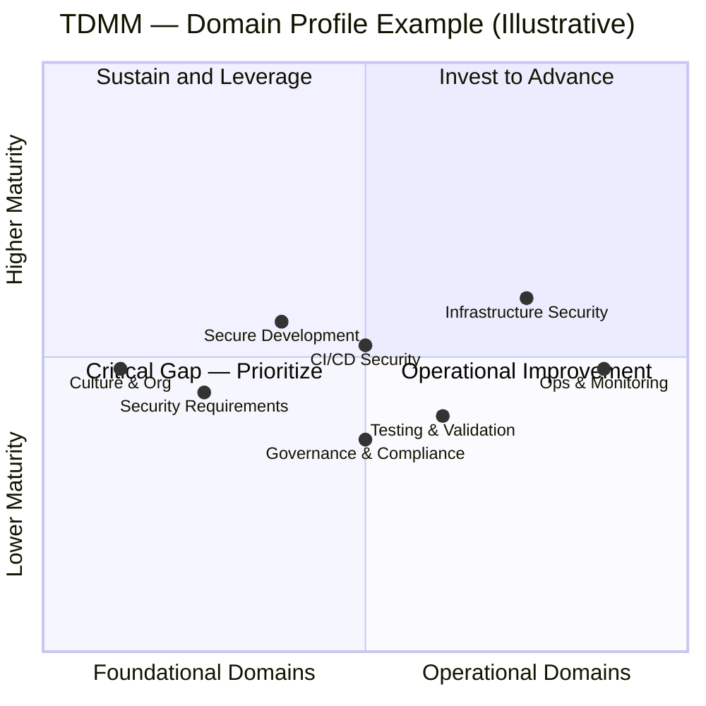
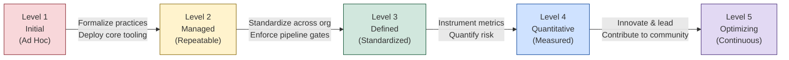
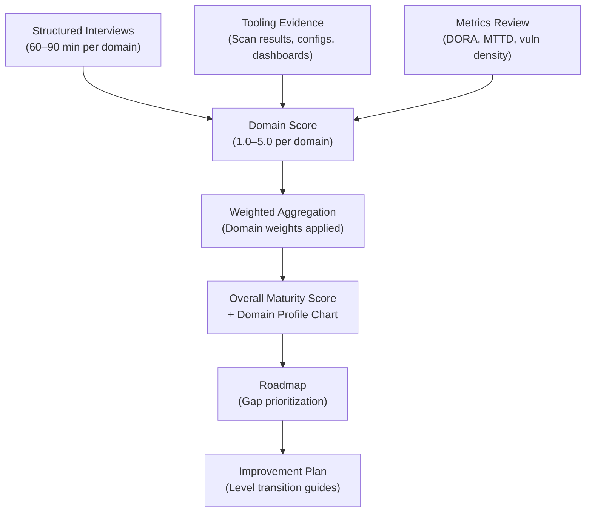

# DevSecOps Maturity Model — Architecture

## Table of Contents

1. [Model Structure Overview](#model-structure-overview)
2. [The Eight Domains](#the-eight-domains)
3. [The Five Maturity Levels](#the-five-maturity-levels)
4. [Full Domain-Level Matrix](#full-domain-level-matrix)
5. [Scoring Methodology](#scoring-methodology)
6. [Assessment Approach](#assessment-approach)
7. [Domain Weighting](#domain-weighting)
8. [Aggregation Model for Overall Score](#aggregation-model-for-overall-score)

---

## Model Structure Overview

The Techstream DevSecOps Maturity Model is structured as a two-dimensional matrix:

- **Vertical axis**: Five maturity levels (1 through 5), representing the sophistication, consistency, and measurability of security practices
- **Horizontal axis**: Eight security domains, representing distinct areas of DevSecOps capability

Each cell in this matrix contains specific criteria that must be met for an organization to score at that level in that domain. An organization's overall maturity score is an aggregated, weighted composite of its domain-level scores.

The model is designed to produce **actionable assessments** — not just an overall score, but a domain-by-domain profile that reveals exactly where improvements are needed and in what sequence they should be addressed.

### Domain-Level Matrix (Mermaid)



### Maturity Level Progression (Mermaid)



### Assessment Evidence Flow (Mermaid)



```
         LEVEL 1       LEVEL 2       LEVEL 3       LEVEL 4       LEVEL 5
         Initial       Managed       Defined       Quantitative  Optimizing
         (Ad Hoc)      (Repeatable)  (Standardized)(Measured)    (Continuous)
       +-------------+-------------+-------------+-------------+-------------+
D1     | Culture &   |             |             |             |             |
       | Org         |             |             |             |             |
       +-------------+-------------+-------------+-------------+-------------+
D2     | Security    |             |             |             |             |
       | Req'ts      |             |             |             |             |
       +-------------+-------------+-------------+-------------+-------------+
D3     | Secure Dev  |             |             |             |             |
       +-------------+-------------+-------------+-------------+-------------+
D4     | CI/CD Sec   |             |             |             |             |
       +-------------+-------------+-------------+-------------+-------------+
D5     | Testing &   |             |             |             |             |
       | Validation  |             |             |             |             |
       +-------------+-------------+-------------+-------------+-------------+
D6     | Infra Sec   |             |             |             |             |
       +-------------+-------------+-------------+-------------+-------------+
D7     | Ops &       |             |             |             |             |
       | Monitoring  |             |             |             |             |
       +-------------+-------------+-------------+-------------+-------------+
D8     | Governance  |             |             |             |             |
       | & Compliance|             |             |             |             |
       +-------------+-------------+-------------+-------------+-------------+
```

---

## The Eight Domains

The eight domains were selected to provide comprehensive coverage of DevSecOps capability while maintaining clear, non-overlapping scope boundaries. Each domain maps to a distinct set of practices, tools, and organizational capabilities.

### Domain 1: Culture & Organization

Covers the human and organizational dimensions of DevSecOps: security awareness, shared responsibility models, security champion programs, training and education programs, team structure, and the degree to which security is embraced as a shared engineering concern rather than a gatekeeping function.

**Why this domain exists**: Tools and processes can only succeed if the people using them understand and embrace security as part of their job. Cultural maturity is the foundation upon which all other domains rest.

### Domain 2: Security Requirements

Covers how security requirements are defined, communicated, and tracked through the development lifecycle: threat modeling practices, abuse case definition, security user stories, security acceptance criteria, regulatory requirements translation, and privacy-by-design integration.

**Why this domain exists**: Security defects are orders of magnitude cheaper to fix when identified at requirements time than when discovered in production. This domain measures whether security is designed in from the start.

### Domain 3: Secure Development

Covers the security practices applied during coding: secure coding standards, language-specific security guidelines, SAST (Static Application Security Testing) tooling, pre-commit hooks, code review security focus, dependency management, and developer security tooling in the IDE.

**Why this domain exists**: Code is the primary attack surface for most applications. This domain measures how effectively organizations prevent the introduction of vulnerabilities at the source.

### Domain 4: CI/CD Security

Covers the security of the build, test, and deployment pipeline itself: pipeline hardening, secrets management, artifact signing and verification, supply chain security (SBOM, provenance), container image scanning, dependency scanning, and infrastructure-as-code security scanning integrated into pipelines.

**Why this domain exists**: The CI/CD pipeline is both a critical security enforcement point and itself an attractive attack target. Compromising the pipeline compromises everything it produces. This domain measures both pipeline security as a protective tool and pipeline integrity as an asset to be protected.

### Domain 5: Testing & Validation

Covers security testing beyond static analysis: DAST (Dynamic Application Security Testing), IAST (Interactive Application Security Testing), API security testing, penetration testing programs, red team exercises, security regression testing, and chaos engineering from a security perspective.

**Why this domain exists**: Runtime security behaviors often cannot be detected statically. This domain measures the depth and consistency of dynamic security validation.

### Domain 6: Infrastructure Security

Covers the security of the platforms on which applications run: cloud configuration management, infrastructure-as-code security, container and Kubernetes security, network segmentation, secrets management infrastructure, certificate management, and cloud security posture management (CSPM).

**Why this domain exists**: Application-level security is undermined if the underlying infrastructure is misconfigured. This domain measures the security hygiene of the platform layer.

### Domain 7: Operations & Monitoring

Covers runtime security visibility and response: security logging standards, SIEM integration, anomaly detection, intrusion detection, security alerting, incident response procedures, post-incident review practices, threat intelligence consumption, and security observability.

**Why this domain exists**: No security program prevents every incident. This domain measures how quickly organizations detect threats and how effectively they respond when security events occur.

### Domain 8: Governance & Compliance

Covers the policy, risk, and compliance layer: security policy management, risk management framework integration, compliance control ownership, audit evidence management, exception and waiver processes, third-party risk, and security metrics reporting to leadership.

**Why this domain exists**: Individual technical controls must be governed by consistent policies and connected to organizational risk management to be sustainable. This domain measures the governance infrastructure that makes technical security controls accountable and auditable.

---

## The Five Maturity Levels

### Level 1 — Initial (Ad Hoc)

Security activities occur reactively, if at all. Practices are undocumented, inconsistent, and dependent on individual heroics. There is no systematic approach to security requirements, testing, or incident response. Security is perceived as a specialized function separate from development and operations.

**Key characteristics**: Reactive, unpredictable, tool-sparse, compliance-driven rather than risk-driven, security team operates as gatekeeper.

### Level 2 — Managed (Repeatable)

Basic security practices have been identified and formalized in at least some teams. Core tooling (SAST, vulnerability scanning) is in place, though coverage is incomplete. Security requirements are documented for critical projects. Some security automation exists in pipelines. Practices are repeatable within teams that have adopted them but not yet consistent across the organization.

**Key characteristics**: Formalized in pockets, basic tooling deployed, security involvement begins earlier in SDLC, compliance posture improving.

### Level 3 — Defined (Standardized)

Security practices are standardized across the organization and integrated consistently throughout the SDLC. Threat modeling is performed for all significant projects. Pipeline security gates are enforced. Security requirements are generated systematically. Incident response procedures are documented and tested. Security metrics are collected, though primarily lagging indicators.

**Key characteristics**: Consistent, documented, organizationally mandated, automated gates in CI/CD, security integrated in development workflow.

### Level 4 — Quantitatively Managed (Measured)

Security is driven by metrics and quantitative risk analysis. The organization measures vulnerability density, mean time to remediate, security debt, and other leading and lagging indicators. Risk quantification (using frameworks such as FAIR) informs investment decisions. Security performance is tracked per team, per application, and per pipeline. Proactive security practices (threat intelligence integration, security chaos engineering) are emerging.

**Key characteristics**: Metrics-driven, risk-quantified, predictable performance, proactive posture, advanced tooling with feedback loops.

### Level 5 — Optimizing (Continuous Improvement)

The security program is self-improving. The organization actively participates in the security community — publishing research, contributing to open source tools, sharing threat intelligence. Security processes are continuously refined based on data. The organization anticipates emerging threats rather than reacting to them. Innovation in security tooling and process is a competitive differentiator.

**Key characteristics**: Continuously improving, industry-leading, threat intelligence integrated, innovation in security practice, security as competitive advantage.

---

## Full Domain-Level Matrix

The following matrix summarizes the key capability threshold that characterizes each domain at each level. The Framework document provides full elaboration of each cell.

| Domain | Level 1 | Level 2 | Level 3 | Level 4 | Level 5 |
|--------|---------|---------|---------|---------|---------|
| **Culture & Org** | Security owned by security team only; no champions program | Security champions nominated in 1-2 teams; awareness training exists | Formal champions program; security embedded in all engineering teams; mandatory training | Security KPIs for engineering teams; security culture metrics tracked | Security culture drives industry benchmarking; org contributes to community |
| **Security Requirements** | Security requirements added ad hoc or not at all | Security requirements documented for critical projects | Threat modeling mandatory for all significant features; abuse cases in backlog | Threat models updated continuously; risk scoring informs prioritization | Automated threat model generation; ML-assisted abuse case detection |
| **Secure Development** | No SAST; no coding standards enforcement | SAST deployed in some pipelines; basic coding guidelines | SAST required in all pipelines with break-build thresholds; IDE security plugins deployed | Vulnerability density tracked per team; security debt quantified and managed | Predictive vulnerability modeling; automated security fix suggestions |
| **CI/CD Security** | No pipeline security controls; secrets in code common | Basic secrets scanning; artifact scanning in some pipelines | Full pipeline hardening; secrets management via vault; SBOM generated | Pipeline security metrics tracked; supply chain integrity verified with signatures | Software factory security rated; provenance attestation for all artifacts |
| **Testing & Validation** | Security testing ad hoc or only in production | DAST run periodically; penetration testing done annually at most | DAST integrated in staging; API security testing; annual pen test with findings tracked | Continuous DAST; bug bounty program; red team exercises quarterly | Adversarial ML for security testing; continuous red team; threat-intel-driven testing |
| **Infrastructure Security** | No IaC scanning; cloud misconfigurations common | Basic CSPM deployed; manual hardening checklists | IaC scanning in pipelines; CIS benchmarks enforced; network segmentation documented | Continuous drift detection; cloud security score tracked; automated remediation | Self-healing infrastructure; AI-assisted anomaly remediation |
| **Ops & Monitoring** | Minimal logging; no centralized SIEM; incident response undocumented | Centralized logging; basic SIEM alerts; incident response documented | Full security logging coverage; tuned SIEM alerts; IR runbooks tested | MTTD and MTTR tracked; threat intelligence feeds; anomaly detection ML models | Real-time threat hunting; automated playbooks; contribution to threat intel sharing |
| **Governance & Compliance** | Security policies informal; compliance reactive | Core security policies documented; compliance frameworks identified | Risk register maintained; compliance controls mapped; exception process defined | Quantitative risk model; compliance metrics in dashboards; continuous control monitoring | Automated policy generation from risk data; predictive compliance posture |

---

## Scoring Methodology

Each domain is scored on a 1.0–5.0 scale. The scoring process uses a **threshold anchoring** approach:

### Threshold Anchoring

A domain receives a whole-number score based on the highest level at which all criteria are substantially met (greater than or equal to 80% of criteria for that level). Partial credit is awarded as decimal fractions between whole numbers.

**Scoring rubric for decimal fractions**:

| Criteria Met at Next Level | Score Modifier |
|---------------------------|---------------|
| 0–20% of next-level criteria | +0.0 |
| 21–40% of next-level criteria | +0.2 |
| 41–60% of next-level criteria | +0.4 |
| 61–80% of next-level criteria | +0.6 |
| 81–99% of next-level criteria | +0.8 |

**Example**: An organization fully meets all Level 2 criteria in CI/CD Security and approximately 50% of Level 3 criteria. Their score for CI/CD Security is 2.4.

### Scoring Boundaries

- **Floor**: The minimum score for any domain is 1.0. An organization that exists is at Level 1 by definition.
- **Ceiling**: The maximum score is 5.0 (all Level 5 criteria fully met).
- **Evidence requirement**: Each criterion must be supported by at least one form of evidence (tooling output, process documentation, interview confirmation, or metric). Asserted-but-unverified criteria are scored as not met.

---

## Assessment Approach

A valid TDMM assessment uses three complementary evidence-gathering methods:

### 1. Structured Interviews

Interview key stakeholders for each domain to understand current practices, perceived gaps, and organizational context. Recommended interview roster:

| Domain | Primary Interviewee | Supporting Interviewee |
|--------|--------------------|-----------------------|
| Culture & Organization | CISO / VP Engineering | Security Champions |
| Security Requirements | Security Architect | Product Manager |
| Secure Development | Lead Developer | Security Engineer |
| CI/CD Security | Platform / DevOps Lead | Security Engineer |
| Testing & Validation | QA Lead / Security Tester | AppSec Engineer |
| Infrastructure Security | Cloud Architect / SRE Lead | Platform Engineer |
| Operations & Monitoring | SOC Lead / SRE | Security Analyst |
| Governance & Compliance | Compliance Officer | Risk Manager |

Interview sessions should be 60–90 minutes per domain, following the structured questionnaire in the Implementation document.

### 2. Tooling Evidence Review

Collect output from security tools as objective evidence of control effectiveness. Key evidence types:

- **SAST/DAST scan results**: Coverage, finding rates, remediation rates
- **Pipeline configuration files**: Gate configurations, scanning integration, break-build thresholds
- **SIEM dashboards**: Alert volumes, MTTD/MTTR metrics, coverage maps
- **Cloud security posture reports**: Compliance scores, misconfiguration counts
- **Vulnerability management data**: Age of open vulnerabilities, SLA compliance rates
- **Training completion records**: Coverage, test scores, refresh cadence
- **Incident response records**: Incident logs, post-mortems, playbook versions

### 3. Metrics and KPI Review

Quantitative metrics provide the most objective evidence of maturity. Request access to:

- Deployment frequency and change failure rate (DORA metrics)
- Mean time to detect (MTTD) and mean time to respond (MTTR) for security incidents
- Vulnerability density per 1,000 lines of code (or per application)
- Security gate pass rate in CI/CD pipelines
- Security training completion percentage
- Percentage of applications with current threat models
- Compliance audit finding counts and remediation rates

---

## Domain Weighting

Not all domains contribute equally to overall organizational security maturity. Weighting reflects the relative impact each domain has on security outcomes, informed by incident causation data and industry research.

| Domain | Weight | Rationale |
|--------|--------|-----------|
| Culture & Organization | 10% | Foundational enabler but hard to measure precisely |
| Security Requirements | 12% | Upstream prevention has high leverage |
| Secure Development | 15% | Code is the primary attack surface |
| CI/CD Security | 15% | Pipeline is both tool and target; supply chain risk is critical |
| Testing & Validation | 12% | Catches what prevention misses |
| Infrastructure Security | 14% | Platform misconfigurations cause major breaches |
| Operations & Monitoring | 12% | Detection and response determine breach impact |
| Governance & Compliance | 10% | Enables sustainability and accountability |

**Total**: 100%

Organizations in regulated industries (financial services, healthcare) may apply customized weights that increase the Governance & Compliance domain weight (up to 20%) and adjust others proportionally.

---

## Aggregation Model for Overall Score

### Weighted Average Calculation

The overall maturity score is calculated as a weighted average of domain scores:

```
Overall Score = Σ (Domain Score × Domain Weight)

Example:
  Culture & Org:           2.4 × 0.10 = 0.24
  Security Requirements:   2.2 × 0.12 = 0.26
  Secure Development:      2.8 × 0.15 = 0.42
  CI/CD Security:          2.6 × 0.15 = 0.39
  Testing & Validation:    2.0 × 0.12 = 0.24
  Infrastructure Security: 3.0 × 0.14 = 0.42
  Operations & Monitoring: 2.4 × 0.12 = 0.29
  Governance & Compliance: 2.6 × 0.10 = 0.26
                                        ------
  Overall Score:                         2.52
```

### Score Interpretation

| Overall Score | Maturity Band | Interpretation |
|--------------|--------------|----------------|
| 1.0 – 1.5 | Level 1 | Ad hoc security; significant risk exposure |
| 1.6 – 2.4 | Transitioning 1→2 | Practices emerging but inconsistent |
| 2.5 – 2.9 | Level 2 | Managed practices in place; gaps remain |
| 3.0 – 3.4 | Transitioning 2→3 | Standardization underway |
| 3.5 – 3.9 | Level 3 | Defined program; consistent execution |
| 4.0 – 4.4 | Transitioning 3→4 | Measurement infrastructure building |
| 4.5 – 4.9 | Level 4 | Quantitative management in place |
| 5.0 | Level 5 | Optimizing program; industry benchmark |

### Domain Profile Reporting

In addition to the overall score, assessments should produce a **domain profile chart** — a radar/spider chart showing scores across all eight domains. This visualization reveals:

- **Balanced vs. imbalanced programs**: A balanced program shows similar scores across domains; an imbalanced program has peaks and valleys that may indicate over-investment in visible areas and under-investment in foundational ones.
- **Critical gaps**: Domains scoring significantly below the overall average represent the highest-risk areas and are typically the best candidates for focused investment.
- **Lagging domains**: Domains where the score is more than 0.8 below the organizational average often indicate structural blockers (skill gaps, tooling debt, organizational resistance) that require dedicated attention.

### Minimum Score Floors

An organization cannot claim an overall Level 3 maturity score if any individual domain score is below 2.0. Similarly, an overall Level 4 claim requires all domains to be at or above 3.0. This floor rule prevents organizations from masking critical weaknesses behind high scores in easier domains.

| Claimed Overall Level | Minimum Score for Any Single Domain |
|----------------------|-------------------------------------|
| Level 2 | 1.5 in all domains |
| Level 3 | 2.0 in all domains |
| Level 4 | 3.0 in all domains |
| Level 5 | 4.0 in all domains |
